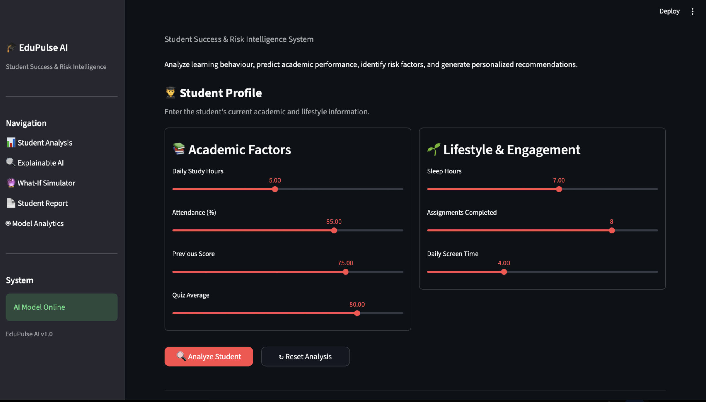
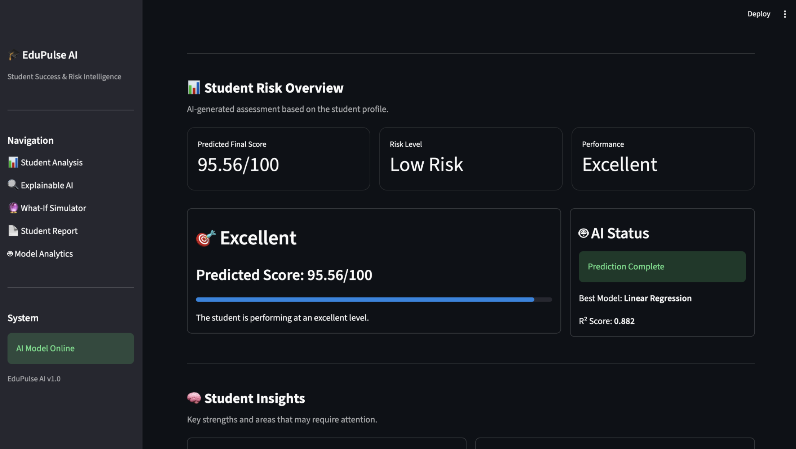

# 🎓 EduPulse AI

## Student Success & Risk Intelligence System

EduPulse AI is a machine learning-powered student intelligence system that predicts academic performance, identifies at-risk students, explains prediction factors, and provides personalized recommendations.


## 🚀 Features

- 📈 Student performance prediction
- 🚨 Low, Medium, and High Risk detection
- 🧠 Explainable AI insights
- 💡 Personalized recommendations
- 🔮 What-If performance simulator
- 👥 At-Risk student detection
- 🚨 Priority student identification
- 📊 Risk distribution analysis
- 📄 PDF student reports
- 🤖 Machine learning model comparison

## 📸 Screenshots

### Student Profile



### Prediction Results



## 🧠 Machine Learning Models

EduPulse AI evaluates multiple machine learning models:

| Model | R² Score |
|---|---:|
| Linear Regression | 0.882 |
| Gradient Boosting | 0.817 |
| Random Forest | 0.787 |
| Decision Tree | 0.429 |

**Best Model:** Linear Regression — **R² = 0.882**

## 🔍 Explainable AI

The system explains how individual student factors influence the predicted performance score.

Factors analyzed include:

- Study Hours
- Attendance
- Previous Score
- Quiz Average
- Sleep Hours
- Assignments Completed
- Screen Time

## 🚨 At-Risk Student Detection

EduPulse AI analyzes the complete student dataset to identify students requiring additional attention.

The system provides:

- Total student count
- High-risk students
- Medium-risk students
- Low-risk students
- Top risk factors
- Priority student list
- Risk distribution

## 🔮 What-If Simulator

The What-If Simulator allows users to explore how changes in:

- Study Hours
- Attendance
- Screen Time

could affect the predicted academic performance.

## 🔄 Workflow

```text
Student Data
     ↓
ML Prediction
     ↓
Risk Detection
     ↓
Explainable AI
     ↓
Recommendations
     ↓
What-If Analysis
     ↓
Student Report